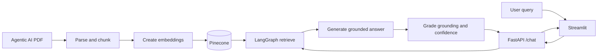

# Agentic AI Document RAG

A retrieval-augmented chatbot that answers questions using the `Ebook-Agentic-AI.pdf` eBook. It provides a Streamlit chat interface and a FastAPI endpoint. Responses include retrieved page-cited passages and a heuristic confidence score.

## Architecture

1. **Ingestion** downloads the PDF into `data/` when it is missing, extracts page text with PyPDF, removes empty pages, and chunks text into 800-character segments with 100-character overlap.
2. **Embeddings and storage** use `sentence-transformers/all-MiniLM-L6-v2` and Pinecone. Each chunk stores source and page metadata. If the configured base index has a different vector dimension, the app creates a compatible `-384-v2` index using the same Pinecone serverless deployment settings.
3. **LangGraph RAG** retrieves up to eight similar chunks, rejects retrieval scores below `0.30`, generates an answer from retrieved context only, and grades answer overlap and page citations against that context.
4. **API and UI** expose the workflow through FastAPI and a Streamlit chat frontend.



## Requirements

- Python 3.10 or later
- A Pinecone API key and an existing Pinecone index configured by name
- A Hugging Face access token for hosted text generation

The local embedding model is downloaded by `sentence-transformers` on first use. The PDF is downloaded automatically if `data/Ebook-Agentic-AI.pdf` is absent.

## Setup

From the repository directory in PowerShell:

```powershell
python -m venv venv
.\venv\Scripts\Activate.ps1
python -m pip install -r requirements.txt
```

Create a `.env` file in the repository root with:

```dotenv
PINECONE_API_KEY=your-pinecone-api-key
PINECONE_INDEX_NAME=agentic-ai-index
HF_TOKEN=your-hugging-face-token
```

`PINECONE_INDEX_NAME` must refer to an index that already exists. If its dimension differs from the local embedding model's 384 dimensions, ingestion creates a compatible sibling index named `<index-name>-384-v2`. The existing index is not deleted.

## Run

Start the API in one terminal:

```powershell
.\venv\Scripts\python.exe -m uvicorn app:app --reload
```

Start the frontend in a second terminal:

```powershell
.\venv\Scripts\python.exe -m streamlit run streamlit_app.py --server.port 8501
```

Open the chat UI at <http://localhost:8501>. The API root is <http://127.0.0.1:8000/> and interactive API documentation is at <http://127.0.0.1:8000/docs>.

## API

Send a POST request to `/chat`:

```json
{
	"query": "What is Agentic AI?"
}
```

The response shape is:

```json
{
	"query": "What is Agentic AI?",
	"final_answer": "Agentic AI refers to systems capable of autonomous decision-making and action in pursuit of specific objectives. [p. 18]",
	"retrieved_context_chunks": [
		"[Page 18]\nAgentic AI refers to systems capable of autonomous decision-making..."
	],
	"confidence_score": 0.84
}
```

If retrieval is not relevant to the question, the API returns `I cannot answer based on the provided document.`, an empty context list, and a confidence score of `0.0`.

## Tests

With the API running, execute the six sample queries and schema/refusal assertions:

```powershell
.\venv\Scripts\python.exe test_sample_queries.py
```

The sample set covers the eBook's definition, architecture, use cases, comparison with generative AI, challenges, and an out-of-scope France question.

## Confidence and Provider Limits

The confidence score is a heuristic: it combines Pinecone's top retrieval similarity with lexical answer-to-context coverage and checks any cited pages against retrieved pages. It is not a calibrated probability or a semantic entailment model.

Hosted text generation uses the Hugging Face router via `HF_TOKEN`. If the account returns HTTP 402 because included credits are depleted, the graph uses extractive fallbacks for the documented sample topics. For other questions it returns relevant PDF excerpts. Restore provider credits or configure a different LLM provider for generated answers to arbitrary questions.
